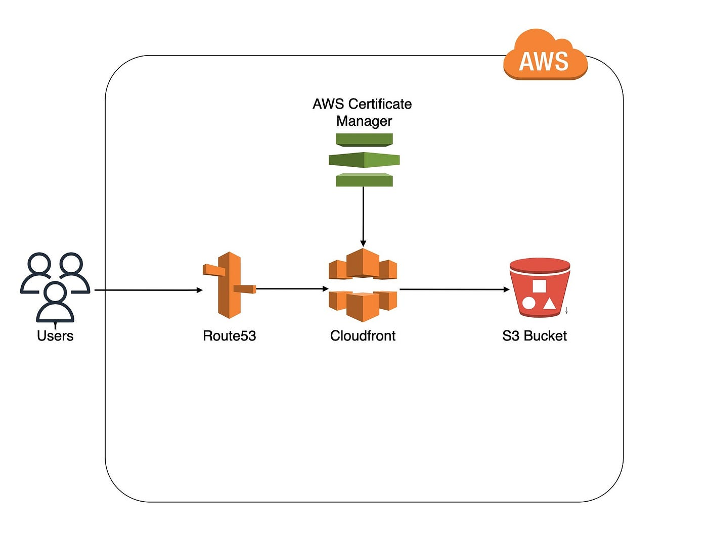
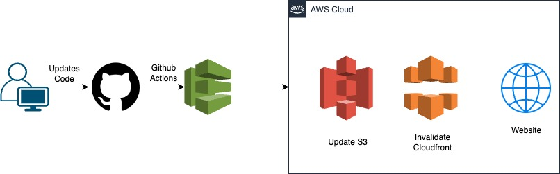

## My portfolio : psharmisha.com

My personal portfolio showcases my journey, skills, and projects. The technology stack I have used for my portfolio includes:

- **Frontend:** HTML, CSS, JavaScript
- **Hosting:** Amazon S3
- **Content Delivery:** Amazon CloudFront
- **Version Control:** GitHub
- **CI/CD:** GitHub Actions, AWS IAM
- **Domain Management:** Amazon Route 53
- **SSL Certificate:** AWS Certificate Manager (ACM)

## Architectural Diagram

## Deployment Diagram

## Domain Registration using Route 53 and ACM
For my personal portfolio website, I chose to use Amazon Route 53 for domain registration and DNS management. Amazon Route 53 provides a reliable and scalable domain name system (DNS) web service. This allowed me to manage my domain name (www.psharmisha.com) and route traffic to my website hosted on Amazon S3 and served via CloudFront.

I also utilized AWS Certificate Manager (ACM) to ensure secure communication between my website visitors and the server. ACM provided me with a free SSL/TLS certificate to enable HTTPS for my website, enhancing security and user trust.

## Deployment using S3 and CloudFront
To host my static website, I utilized Amazon S3, which offers simple storage for web content and easy scalability. I created an S3 bucket and configured it for static website hosting, making my website files accessible over the internet.

To optimize content delivery and enhance performance, I integrated Amazon CloudFront with my S3 bucket. CloudFront is a content delivery network (CDN) that securely delivers data, videos, applications, and APIs globally with low latency.

## CI/CD Pipeline for Continuous Integration and Deployment
I implemented a robust CI/CD pipeline using GitHub Actions. This pipeline automates the process of building, deploying, and updating my portfolio website whenever changes are pushed to the repository. The workflow involves the following steps:

1. **GitHub Actions Configuration:** I created a workflow file (`main.yml`) in the `.github/workflows` directory within this repository.
2. **Workflow Steps:** The workflow consists of steps to:
   - Check out the repository code.
   - Install the AWS CLI to interact with AWS services.
   - Build the website using build scripts.
   - Sync website files to the S3 bucket using the AWS CLI's `aws s3 sync` command.
   - Invalidate CloudFront cache to ensure visitors receive the latest content.
3. **AWS Credentials Management:** AWS access credentials (AWS_ACCESS_KEY_ID and AWS_SECRET_ACCESS_KEY) and CLOUDFRONT Distribution ID and S3 Bucket Name are stored as encrypted secrets in the GitHub repository settings.
4. **Triggering Workflow:** The workflow is automatically triggered whenever changes are pushed to the main branch.
5. **Benefits of CI/CD:** The CI/CD pipeline ensures that updates to the website are automatically deployed, reducing manual intervention and enabling rapid iteration.

By implementing this CI/CD pipeline, I maintain a seamless and efficient process for updating and deploying my personal portfolio, enabling me to focus more on creating content and showcasing my projects.
